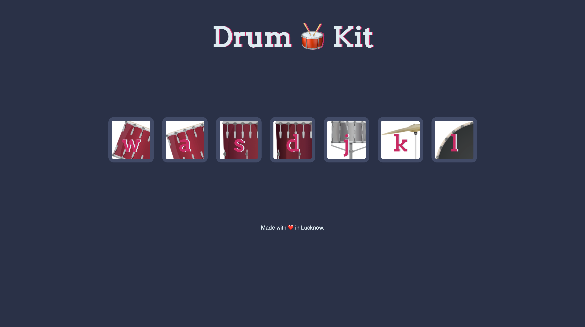

# Drum Kit Web App

## Overview
The Drum Kit Web App is an interactive and fun musical application that allows users to play various drum sounds with just a click or a keyboard press. It's perfect for music enthusiasts and anyone looking to experiment with rhythm and beats.

## Features
- Play a wide range of drum sounds by clicking on the virtual drum kit or by using keyboard keys.
- Realistic drum sounds for an immersive experience.
- User-friendly and intuitive interface.
- Visual feedback to enhance the interactive experience.
- Responsive design for seamless use on both desktop and mobile devices.

## Demo
You can try out the Drum Kit Web App live at [drumbajao.netlify.app](https://drumbajao.netlify.app/).

## Usage
1. Visit the [live demo](https://drumbajao.netlify.app/) or clone this repository to your local machine.
2. Open the `index.html` file in your web browser to play the drum kit.
3. Click on the drum elements or use the corresponding keyboard keys to create beats and rhythms.

## Technologies Used
- HTML5
- CSS3
- JavaScript

## Author
- [Vivek Tripathi](https://github.com/vivek-tripathi-9005)
